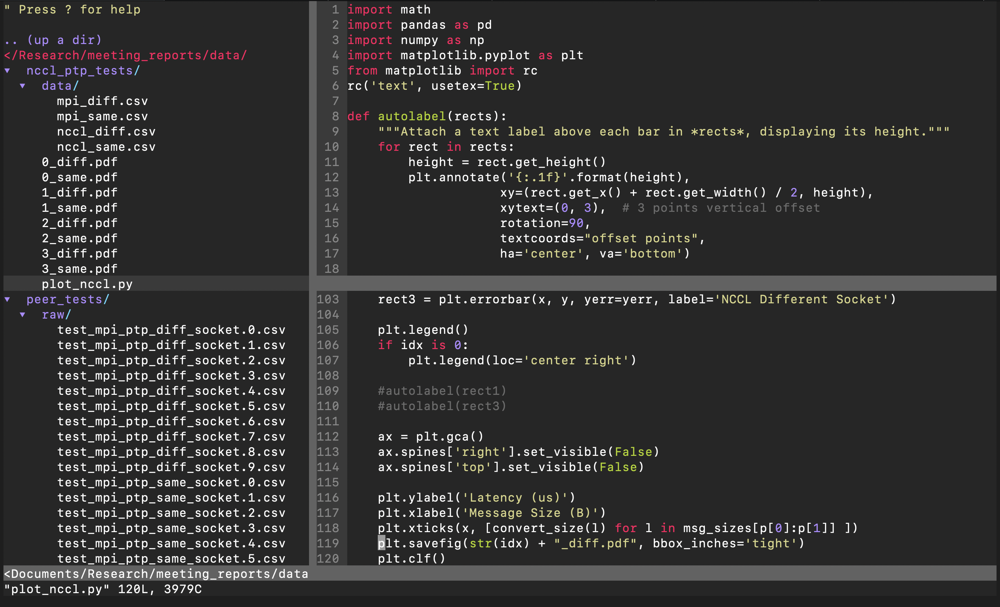

# .vim

This repo contains my vim config so I can have the same config when sshing into various servers.


## Installation

```cd && git clone --recurse-submodules https://www.github.com/yiltan/dotvim .vim && cd .vim && ./init.sh```

## Plugins

1. [NERDTree](https://www.github.com/scrooloose/nerdtree)
   - Project Explorer, it gives a tree-view of the files.
2. [Syntastic](https://www.github.com/vim-syntastic/syntastic)
   - Syntax Checker
3. [Vim Monokai](https://www.github.com/sickill/vim-monokai)
   - Sublime Text Colour Scheme

